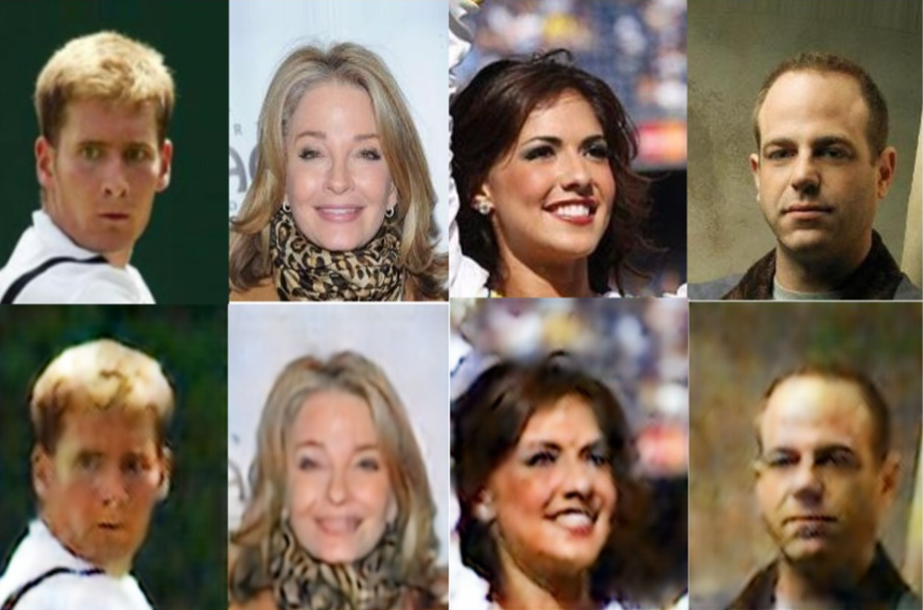
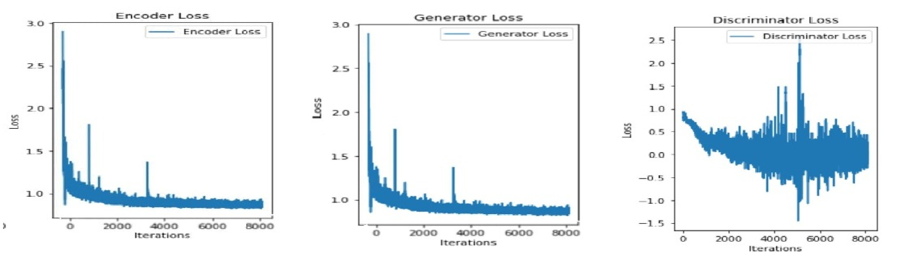
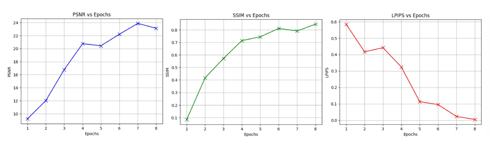

# 📦 Image Compression Project Results  
*Using WGAN & Linformer*

This report presents the visual and quantitative results of an image compression framework based on **Wasserstein GAN (WGAN)** and **Linformer** attention mechanisms. The approach focuses on maintaining high visual fidelity while ensuring efficient compression.

The dataset used for this research is CelebaFaceAttribute dataset.
https://www.kaggle.com/datasets/jessicali9530/celeba-dataset

---

## 🖼️ Result 1: Input vs. Reconstructed Image

*Description:*  
This figure shows a side-by-side comparison of the original input image and the reconstructed image after compression and decompression using the proposed model. The reconstructed output retains key features, textures, and visual coherence, indicating the model's ability to preserve perceptual quality.

---

## 📉 Result 2: Training Loss Curves

*Description:*  
The plot illustrates the training losses of the **Generator**, **Critic**, and **Encoder** over the training epochs.  
- The **Generator Loss** indicates the model's progress in fooling the critic.
- The **Critic Loss** reflects its ability to differentiate between real and fake images.
- The **Encoder Loss** helps maintain latent consistency during compression.
---

## 📈 Result 3: Evaluation Metrics – PSNR, LPIPS, SSIM

*Description:*  
The third plot presents quantitative metrics:
- **PSNR (Peak Signal-to-Noise Ratio)**: Measures reconstruction fidelity in terms of pixel similarity.
- **LPIPS (Learned Perceptual Image Patch Similarity)**: Captures perceptual similarity from deep features.
- **SSIM (Structural Similarity Index Measure)**: Evaluates structural integrity of reconstructed images.

